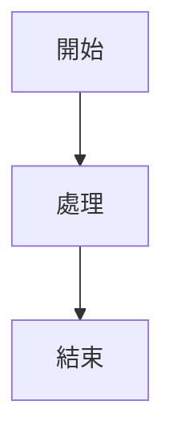
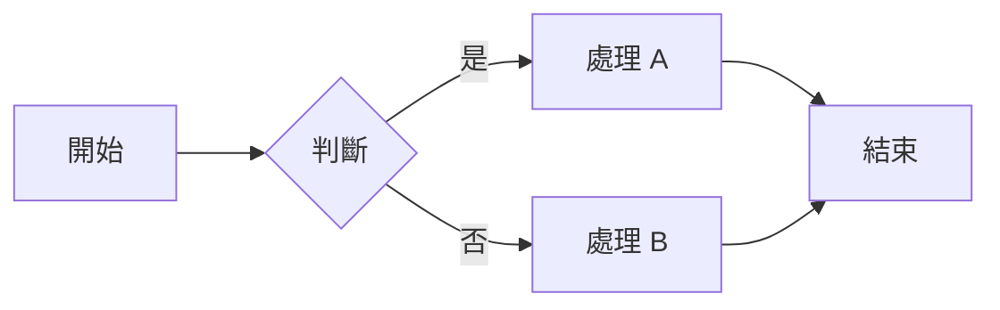

## 目標

整合 mermaid.js，支援在 Markdown 中繪製流程圖、圓餅圖、甘特圖等。

## 功能規格 (Technical Specs)

### 核心需求
1. **Mermaid 語法支援**：偵測 ` ```mermaid ` code block
2. **圖表類型**：支援流程圖、時序圖、甘特圖、圓餅圖等
3. **樣式整合**：圖表樣式與主題一致
4. **互動功能**：支援縮放、下載等（可選）

### 技術實作

**mermaid.js 整合**：

```html
<!-- template.html -->
<script src="https://cdn.jsdelivr.net/npm/mermaid@10/dist/mermaid.min.js"></script>
<script>
mermaid.initialize({
    startOnLoad: true,
    theme: 'default' // 或 'dark', 'forest', 'neutral'
});
</script>
```

**Markdown 語法**：
````markdown

````

**渲染處理**：
- goldmark 將 ` ```mermaid ` 轉為 `<pre class="mermaid">`
- mermaid.js 自動處理並渲染為 SVG

### 支援的圖表類型

| 類型 | 語法 | 說明 |
|------|------|------|
| 流程圖 | `graph` / `flowchart` | 流程與決策 |
| 時序圖 | `sequenceDiagram` | 系統互動 |
| 甘特圖 | `gantt` | 專案進度 |
| 圓餅圖 | `pie` | 比例分布 |
| ER 圖 | `erDiagram` | 資料庫結構 |
| 狀態圖 | `stateDiagram` | 狀態轉換 |

## 使用說明 (User Guide)

在文中輸入代碼即可生成流程圖、圓餅圖或甘特圖。適合技術文件與專案進度管理。

## 子任務

### T021-A — mermaid.js 整合
- 載入 mermaid.js（CDN 或本地）
- 初始化設定
- 偵測 ` ```mermaid ` code block

### T021-B — 主題整合
- 深色主題使用 `theme: 'dark'`
- 淺色主題使用 `theme: 'default'`
- 主題切換時更新

### T021-C — 圖表類型測試
- 流程圖
- 時序圖
- 甘特圖
- 圓餅圖

### T021-D — 樣式調整
- 圖表大小適中
- 字體與主文一致
- 顏色協調

### T021-E — 效能優化
- 延遲載入 mermaid.js
- 大型圖表不卡頓
- 錯誤處理（語法錯誤時顯示提示）

## 產出

- `assets/template.html` 更新（mermaid.js 載入）
- `assets/markdown.css` 更新（圖表樣式）

## 驗收標準

- [ ] ` ```mermaid ` code block 正確渲染為圖表
- [ ] 支援流程圖、時序圖、甘特圖、圓餅圖
- [ ] 深色/淺色主題下圖表樣式正確
- [ ] 語法錯誤時顯示提示
- [ ] 大型圖表不卡頓

## 範例

輸入：
````markdown

````

輸出：
- 渲染為流程圖
- 節點為矩形，判斷為菱形
- 箭頭指向正確

---

*建立時間：2026-04-24 by 寶寶*
